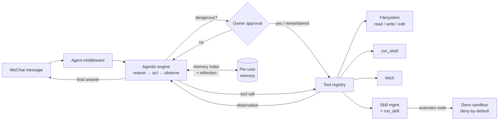
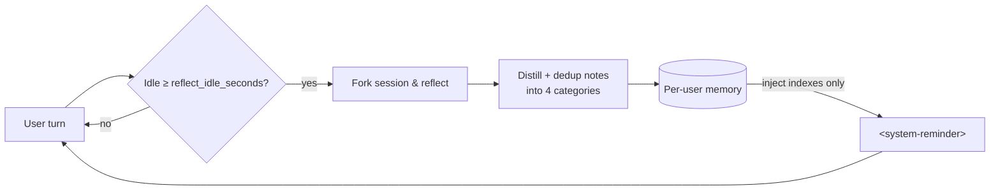

# zzyclaw

An **agentic/reflective AI agent** bult from scratch. 

## Features

- **Agentic loop** — multi-step reason → act → observe loop over a tool registry.
- **Reflective memory** — per-user *dynamic structural memory*: the
  agent reflects on idle sessions, distills semantic structural notes into durable memory.
- **Dynamic Skill** — self-contained, pluggable skills loaded at runtime:
  builtin, owner-shared, and isolated per user.
- **Deno-based Sandbox** — user-authored skill code executes in Deno with
  deny-by-default permissions (no env, no subprocess, no FFI, no remote imports).
- **Approval gate** — powerful tools (shell, network, workspace writes) are
  owner-gated and pause the turn for an explicit yes/no.

---

## 1. Agentic tool-calling AI agent bot

The agent runs an agentic tool-calling loop ([agent/engine.go](agent/engine.go)):
on each turn it asks the model what to do, executes any requested tool calls,
feeds the results back, and repeats until the model produces a final answer (or a
dangerous action requires approval).



Built-in tools registered in [main.go](main.go):

| Tool | Purpose |
| --- | --- |
| `read_file`, `write_file`, `edit_file` | Structured file access within the sandboxed workspace |
| `list_dir`, `search_files`, `delete_path` | Workspace inspection and cleanup |
| `run_shell` | Build/run/lint/test commands (owner-gated, per-command checked) |
| `fetch` | HTTP(S) request (GET/POST/PATCH/DELETE) with optional body and headers; a GET to a pre-trusted host is allowlisted, other hosts and any state-changing method are approval-gated and can be remembered |
| `run_skill` | Execute a skill's code in the Deno sandbox (skills declaring `write`/`net` are approval-gated, per-call checked) |
| `list_skills`, `load_skill`, `unload_skill`, `create_skill`, `delete_skill` | Skill management |
| `remember`, `recall`, `forget` | Structural memory across four categories (when `memory_enabled`) |

## 2. Reflective Memory

Optional, per-user, and off by default (`memory_enabled`), the agent keeps a
*dynamic structural memory* modeled on Claude-style reflective memory. When on,
the agent gets `remember`, `recall`, and `forget` tools, and only memory
*indexes* (short summaries) — never full detail — are injected into a
`<system-reminder>` placed just before the latest user message
([agent/structmem.go](agent/structmem.go),
[agent/structmemtools.go](agent/structmemtools.go)).

Notes are organized into four fixed categories:

| Category | Holds |
| --- | --- |
| `personal` | The user's character, preferences, role and style |
| `feedback` | Explicit choices, corrections and feedback the user gave |
| `project` | Facts about the current project the work concerns |
| `reference` | Anything else reusable across conversations |

After a quiet period (`reflect_idle_seconds`, default 120s) the agent **forks**
the session and reflects on it out-of-band, distilling concise, deduplicated
notes without disturbing the live turn. A content-hash watermark avoids
re-reflecting the same history, and conversations shorter than
`reflect_min_messages` (default 4) are skipped
([agent/reflect.go](agent/reflect.go)).



Recall and dedup are **semantic**: indexes are embedded (`embedding_model`,
default `text-embedding-3-small`) and ranked by cosine similarity, so `recall`
returns the most relevant notes rather than the most recent. `memory_inject`
caps how many indexes per category enter context each turn; near-duplicate
entries merge, and a per-category soft cap (`memory_soft_cap`, default 30)
triggers a consolidation pass so memory can't grow unbounded. Detail is stored
alongside conversation history (Redis when configured, otherwise in-process) and
is **isolated per user** — one user's memory is never visible to another. The
`StructuralMemory` interface keeps the embedder pluggable.

## 3. Dynamic Skill Management

A **skill** is a self-contained directory, each containing
a `SKILL.md` file with YAML-ish frontmatter (name, description, and optional
runtime/permission fields) followed by markdown instructions. Executable skills
also ship their entry source file (e.g. `skill.js`) in the same folder, so a
skill can be installed or deleted as a single unit
([agent/skill/registry.go](agent/skill/registry.go)). The **builtin** skills
(e.g. `write-skill`) are compiled into the binary and served from memory, an
optional shared on-disk registry holds skills published by owners, and each
user's own skills live in their private `<workspace>/<user>/skills` directory; a
manager layers the three so users share builtins (and any shared skills) but
never see each other's private skills ([agent/skill/manager.go](agent/skill/manager.go)).

```
(builtins compiled into the binary — e.g. write-skill — never on disk)
<skills_dir>/                # optional shared skills, visible to all users
  team-skill/
    SKILL.md
<workspace>/<user>/skills/   # private to one user
  my-skill/
    SKILL.md        # frontmatter + instructions
    skill.js        # entry code run by Deno (optional)
```

The agent manages skills at runtime via dedicated tools — **not** the generic
file tools — so files always land in the right place
([agent/skilltools.go](agent/skilltools.go)):

- `list_skills` — enumerate available skills, each tagged with its scope
  (`builtin` / `shared` / `private`) and whether it is loaded.
- `load_skill` / `unload_skill` — pull a skill's full instructions into (or out
  of) the current conversation.
- `create_skill` — author a new skill folder (`SKILL.md` + optional entry file).
  Pass `shared: true` (owners only) to publish it to the shared registry for all
  users instead of your private directory.
- `delete_skill` — remove a skill folder. Deletes your private skill by default;
  pass `shared: true` (owners only) to remove a shared skill, which removes it
  for every user.

Frontmatter fields (parsed in [agent/skill/registry.go](agent/skill/registry.go)):

| Field | Meaning |
| --- | --- |
| `name` | Unique identifier (`^[a-z0-9][a-z0-9-]{0,63}$`) |
| `description` | Short summary used to decide when to load |
| `runtime` | `deno` for executable skills; empty = instructions-only |
| `entry` | Entry source file (default `skill.js`; `.ts`/`.mjs` allowed) |
| `net` | Network hosts the skill may reach (default: none) |
| `write` | Allow the skill to write to the workspace (default: read-only) |

System-seeded skills (e.g. `write-skill`) are marked **builtin** from a
compiled-in allowlist — never from frontmatter — so an untrusted skill cannot
claim builtin status, and builtin skills cannot be overwritten or deleted.

## 4. Deno-based Sandbox

User-authored skill code never runs in the host process. Instead it executes
out-of-process in Deno, which is **deny-by-default**: the guest gets only the
read/write paths, network hosts, and environment variables explicitly granted
for that run, and nothing else ([agent/tools/deno.go](agent/tools/deno.go)).

Each run is launched with hardened flags:

- `--no-prompt` — fail closed instead of prompting for permissions.
- `--no-remote` — a skill cannot pull arbitrary code at import time.
- `--no-config` — ignore any config/lockfile inside the skill directory.
- `--allow-read` / `--allow-write` / `--allow-net` — granted narrowly per run.
- `--allow-env=NAME,...` — only when a skill declares `env`; scoped to the named
  variables (never a bare `--allow-env`). The sandbox otherwise hides the host
  environment, and only the declared names are passed through with their host
  values.
- `--v8-flags=--max-old-space-size` — caps the V8 heap (`skill_memory_mb`,
  default 256 MB) so a runaway allocation OOMs the contained process instead of
  pressuring the host.

Default grant for a skill: **read-only** access to its own directory and the
workspace, **no network**, and **no environment access**. A skill opts into more
by declaring `write: true`, `net: host-a, host-b`, or `env: NAME_A, NAME_B` in
its frontmatter. The sandbox is the *enforcement* boundary, but `run_skill` is
still a generic launcher whose risk depends on the specific script: a skill that
declares `write`, `net`, or `env` is treated as dangerous, so running it is
owner-gated and asks for approval (reply `always` to remember that skill and its
declared access). Read-only skills with no network or env access run without a
prompt. `run_skill` can never be wholesale auto-approved. All user-added
executable skills must use `runtime: deno`.

Resource use is bounded on two axes: each run is hard-killed after
`skill_timeout_seconds` (default 30s) of wall-clock, and the V8 heap is capped by
`skill_memory_mb`. Since a skill gets no `--allow-run`, it cannot spawn host
processes (no fork bombs), and CPU/memory spikes are confined to the sandboxed
process and torn down with it.

Deno's internal cache (`DENO_DIR`) is pointed at a separate cache directory so it
never touches the skill or workspace directories. If the Deno binary is not
found, skill execution is simply inactive (the rest of the agent still runs).

---

## Getting started

### Prerequisites

- Go 1.25+
- [Deno](https://deno.com/) 2.x (optional; required only to run executable skills)
- Redis (optional; enables persistent conversation memory)
- A GitHub account with Copilot access (used for model inference)

### Configure

```sh
cp config.example.toml config.toml
```

Edit `config.toml` to taste. All settings can also be supplied via environment
variables with the `ZZY_` prefix (e.g. `ZZY_REDIS_ADDR`).

Notable options ([config.example.toml](config.example.toml)):

| Setting | Description |
| --- | --- |
| `copilot.model` | Model used for inference (e.g. `gpt-4o`) |
| `agent.owners` | User IDs allowed to approve dangerous tools |
| `agent.auto_approve` | Tools that skip the approval prompt |
| `agent.network_allowlist` | Hosts `fetch` GETs without prompting (other hosts, and any POST/PATCH/DELETE, are asked once, then remembered if approved with `always`) |
| `agent.skills_dir` / `agent.workspace_dir` | Skill and workspace roots |
| `agent.deno_path` | Path to the Deno binary (empty = look up on `PATH`) |
| `agent.skill_timeout_seconds` | Wall-clock budget per sandboxed skill run |
| `redis.addr` | Redis address; empty = in-memory memory |

### Run locally

```sh
go build ./...
go run .
```

The bot login is interactive — scan the QR code shown in the terminal with
WeChat to authenticate.

### Run with Docker

```sh
cp config.example.toml config.toml   # then edit
docker compose up --build
```

`docker-compose.yml` runs the app as a non-root user with dropped Linux
capabilities, `no-new-privileges`, a PID limit, and memory/CPU caps to contain
the blast radius of shell/skill execution. Credentials, skills, and conversation
data are persisted in the `app-data` Docker volume (mounted at `/app/data`;
inspect it with `docker compose exec app ls /app/data`).

## Project layout

```
main.go            Wiring: config, agent assembly, bot manager, login
config/            Configuration loading (TOML + ZZY_* env vars)
copilot/           GitHub Copilot auth + chat client
agent/             Agentic engine, sessions, memory, middleware
  engine.go        The reason → act → observe loop
  skill/           Disk-backed skill registry (SKILL.md folders)
  tools/           Sandboxed filesystem, shell, http, and Deno runner
botmgr/            Multi-bot management
middlewares/       Logging, command, locker, base middleware
resume/            Resume extraction/export feature
```

## Development

```sh
go build ./...
go test ./...
golangci-lint run ./...   # v2.x (CI uses golangci-lint-action@v7)
```

### Troubleshooting

Set `log.level = "debug"` in `config.toml` (or `ZZY_LOG_LEVEL=debug`) to dump
diagnostic detail to the console, including:

- each model completion (final text and the tool calls it requests);
- every tool call's arguments and result;
- the exact Deno command, granted permissions, and the full (untruncated)
  stdout/stderr of each sandboxed skill run.

This is the quickest way to see why a `runtime: deno` skill fails — e.g. a
"module not found" error usually means the skill imports a remote/`npm:`/`jsr:`
module, which the sandbox blocks (`--no-remote`); only local files within the
skill directory and the standard library are available.
