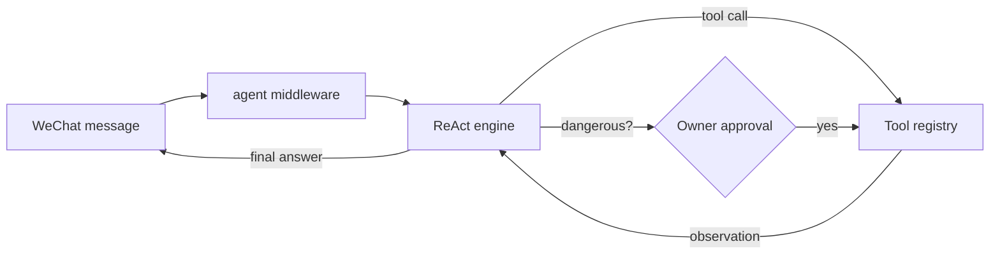

# zzy

A WeChat chat bot backed by a **ReAct-style AI agent**. Messages from WeChat are
handled by a reasoning-and-acting loop that can use tools, manage its own
skills, and run untrusted skill code inside a **Deno sandbox**. The model is
served through the GitHub Copilot API.

> Threat model: WeChat messages are untrusted input. The agent is designed so
> that a prompt-injection attempt cannot escalate into arbitrary code execution
> or data exfiltration — dangerous actions are owner-gated and require approval,
> and skill code runs deny-by-default in a sandbox.

## Features

- **ReAct agent** — multi-step reason → act → observe loop over a tool registry.
- **Skill management** — self-contained, pluggable skills loaded at runtime:
  builtin, owner-shared, and isolated per user.
- **Deno-based sandbox** — user-authored skill code executes in Deno with
  deny-by-default permissions (no env, no subprocess, no FFI, no remote imports).
- **Pluggable memory** — Redis-backed conversation memory, or in-memory when no
  Redis is configured.
- **Approval gate** — powerful tools (shell, network, workspace writes) are
  owner-gated and pause the turn for an explicit yes/no.

---

## 1. ReAct-based AI agent bot

The agent runs a Reasoning-and-Acting loop ([agent/engine.go](agent/engine.go)):
on each turn it asks the model what to do, executes any requested tool calls,
feeds the results back, and repeats until the model produces a final answer (or a
dangerous action requires approval).



Built-in tools registered in [main.go](main.go):

| Tool | Purpose |
| --- | --- |
| `read_file`, `write_file`, `edit_file` | Structured file access within the sandboxed workspace |
| `list_dir`, `search_files`, `delete_path` | Workspace inspection and cleanup |
| `run_shell` | Build/run/lint/test commands (owner-gated, per-command checked) |
| `http_get` | Fetch URLs; pre-trusted hosts are allowlisted, others are approval-gated and can be remembered |
| `run_skill` | Execute a skill's code in the Deno sandbox |
| `list_skills`, `load_skill`, `unload_skill`, `create_skill`, `delete_skill` | Skill management |

Key safety mechanics:

- **Owner gating** — tools that report themselves as dangerous are only
  approvable by configured `owners`. With no owners set the gate is disabled.
- **Auto-approve allowlist** — low-risk tools can be added to `auto_approve`;
  tools flagged "never auto-approve" (e.g. `run_shell`) are still evaluated per
  call.
- **Remembered approvals** — when prompted for a dangerous action you can reply
  `yes` (allow once), `always` (allow and remember the scope), or `no`. `always`
  decisions are stored **per user** in the shared store (Redis when configured,
  otherwise process-local) so equivalent calls skip the prompt: `http_get` is
  remembered per host (growing the allowlist on demand), and file
  writes/edits/deletes are remembered per directory. One user's grants
  never apply to another.
- **Workspace is writable by default** — file writes/edits/deletes inside the
  agent **workspace root** are pre-approved and never prompt; the gate (and the
  remembered-approval flow above) only applies to mutations outside it, such as
  the skills directory.
- **Per-user workspaces** — each user gets a private subdirectory of the
  workspace root. Relative paths, the `run_shell` working directory and a
  skill's workspace access are all confined to the calling user's own directory,
  so one user can never read or write another user's files.
- **Per-user skills** — every skill the agent authors at runtime lives in the
  calling user's own skills directory (`<workspace>/<user>/skills`). Users can
  only list, load, run, create or delete their own skills; one user can never
  see or invoke another user's skill by name. The **builtin** skills (e.g.
  `write-skill`) are compiled into the binary and served from memory, visible to
  everyone and impossible for a user to overwrite or delete
  ([agent/skill/manager.go](agent/skill/manager.go)).
- **Shared skills** — owners (`agent.owners`) can publish a skill to the shared
  on-disk registry (`create_skill` with `shared: true`), making it visible to
  and runnable by every user. When no owners are configured the gate is disabled
  and any user may manage shared skills, mirroring the dangerous-tool owner gate.
- **Bounded loops** — `max_iterations` caps reasoning steps per turn and
  `max_history` caps stored messages per session.

## 2. Skill management

A **skill** is a self-contained directory, each containing
a `SKILL.md` file with YAML-ish frontmatter (name, description, and optional
runtime/permission fields) followed by markdown instructions. Executable skills
also ship their entry source file (e.g. `skill.js`) in the same folder, so a
skill can be installed or deleted as a single unit
([agent/skill/registry.go](agent/skill/registry.go)). The **builtin** skills
(e.g. `write-skill`) are compiled into the binary and served from memory, an
optional shared on-disk registry holds skills published by owners, and each
user's own skills live in their private `<workspace>/<user>/skills` directory; a
manager layers the three so users share builtins (and any shared skills) but
never see each other's private skills ([agent/skill/manager.go](agent/skill/manager.go)).

```
(builtins compiled into the binary — e.g. write-skill — never on disk)
<skills_dir>/                # optional shared skills, visible to all users
  team-skill/
    SKILL.md
<workspace>/<user>/skills/   # private to one user
  my-skill/
    SKILL.md        # frontmatter + instructions
    skill.js        # entry code run by Deno (optional)
```

The agent manages skills at runtime via dedicated tools — **not** the generic
file tools — so files always land in the right place
([agent/skilltools.go](agent/skilltools.go)):

- `list_skills` — enumerate available skills and whether each is loaded.
- `load_skill` / `unload_skill` — pull a skill's full instructions into (or out
  of) the current conversation.
- `create_skill` — author a new skill folder (`SKILL.md` + optional entry file).
  Pass `shared: true` (owners only) to publish it to the shared registry for all
  users instead of your private directory.
- `delete_skill` — remove a skill folder. Pass `shared: true` (owners only) to
  remove a shared skill.

Frontmatter fields (parsed in [agent/skill/registry.go](agent/skill/registry.go)):

| Field | Meaning |
| --- | --- |
| `name` | Unique identifier (`^[a-z0-9][a-z0-9-]{0,63}$`) |
| `description` | Short summary used to decide when to load |
| `runtime` | `deno` for executable skills; empty = instructions-only |
| `entry` | Entry source file (default `skill.js`; `.ts`/`.mjs` allowed) |
| `net` | Network hosts the skill may reach (default: none) |
| `write` | Allow the skill to write to the workspace (default: read-only) |

System-seeded skills (e.g. `write-skill`) are marked **builtin** from a
compiled-in allowlist — never from frontmatter — so an untrusted skill cannot
claim builtin status, and builtin skills cannot be overwritten or deleted.

## 3. Deno-based sandbox

User-authored skill code never runs in the host process. Instead it executes
out-of-process in Deno, which is **deny-by-default**: the guest gets only the
read/write paths and network hosts explicitly granted for that run, and nothing
else ([agent/tools/deno.go](agent/tools/deno.go)).

Each run is launched with hardened flags:

- `--no-prompt` — fail closed instead of prompting for permissions.
- `--no-remote` — a skill cannot pull arbitrary code at import time.
- `--no-config` — ignore any config/lockfile inside the skill directory.
- `--allow-read` / `--allow-write` / `--allow-net` — granted narrowly per run.

Default grant for a skill: **read-only** access to its own directory and the
workspace, and **no network**. A skill opts into more by declaring `write: true`
or `net: host-a, host-b` in its frontmatter — and those elevated runs then
require approval. All user-added executable skills must use `runtime: deno`.

Deno's internal cache (`DENO_DIR`) is pointed at a separate cache directory so it
never touches the skill or workspace directories. If the Deno binary is not
found, skill execution is simply inactive (the rest of the agent still runs).

---

## Getting started

### Prerequisites

- Go 1.25+
- [Deno](https://deno.com/) 2.x (optional; required only to run executable skills)
- Redis (optional; enables persistent conversation memory)
- A GitHub account with Copilot access (used for model inference)

### Configure

```sh
cp config.example.toml config.toml
```

Edit `config.toml` to taste. All settings can also be supplied via environment
variables with the `ZZY_` prefix (e.g. `ZZY_REDIS_ADDR`).

Notable options ([config.example.toml](config.example.toml)):

| Setting | Description |
| --- | --- |
| `copilot.model` | Model used for inference (e.g. `gpt-4o`) |
| `agent.owners` | User IDs allowed to approve dangerous tools |
| `agent.auto_approve` | Tools that skip the approval prompt |
| `agent.network_allowlist` | Hosts `http_get` reaches without prompting (others are asked once, then remembered if approved with `always`) |
| `agent.skills_dir` / `agent.workspace_dir` | Skill and workspace roots |
| `agent.deno_path` | Path to the Deno binary (empty = look up on `PATH`) |
| `agent.skill_timeout_seconds` | Wall-clock budget per sandboxed skill run |
| `redis.addr` | Redis address; empty = in-memory memory |

### Run locally

```sh
go build ./...
go run .
```

The bot login is interactive — scan the QR code shown in the terminal with
WeChat to authenticate.

### Run with Docker

```sh
cp config.example.toml config.toml   # then edit
docker compose up --build
```

`docker-compose.yml` runs the app as a non-root user with dropped Linux
capabilities, `no-new-privileges`, a PID limit, and memory/CPU caps to contain
the blast radius of shell/skill execution. Credentials, skills, and conversation
data are persisted in the `app-data` Docker volume (mounted at `/app/data`;
inspect it with `docker compose exec app ls /app/data`).

## Project layout

```
main.go            Wiring: config, agent assembly, bot manager, login
config/            Configuration loading (TOML + ZZY_* env vars)
copilot/           GitHub Copilot auth + chat client
agent/             ReAct engine, sessions, memory, middleware
  engine.go        The reason → act → observe loop
  skill/           Disk-backed skill registry (SKILL.md folders)
  tools/           Sandboxed filesystem, shell, http, and Deno runner
botmgr/            Multi-bot management
middlewares/       Logging, command, locker, base middleware
resume/            Resume extraction/export feature
```

## Development

```sh
go build ./...
go test ./...
golangci-lint run ./...   # v2.x (CI uses golangci-lint-action@v7)
```

### Troubleshooting

Set `log.level = "debug"` in `config.toml` (or `ZZY_LOG_LEVEL=debug`) to dump
diagnostic detail to the console, including:

- each model completion (final text and the tool calls it requests);
- every tool call's arguments and result;
- the exact Deno command, granted permissions, and the full (untruncated)
  stdout/stderr of each sandboxed skill run.

This is the quickest way to see why a `runtime: deno` skill fails — e.g. a
"module not found" error usually means the skill imports a remote/`npm:`/`jsr:`
module, which the sandbox blocks (`--no-remote`); only local files within the
skill directory and the standard library are available.
